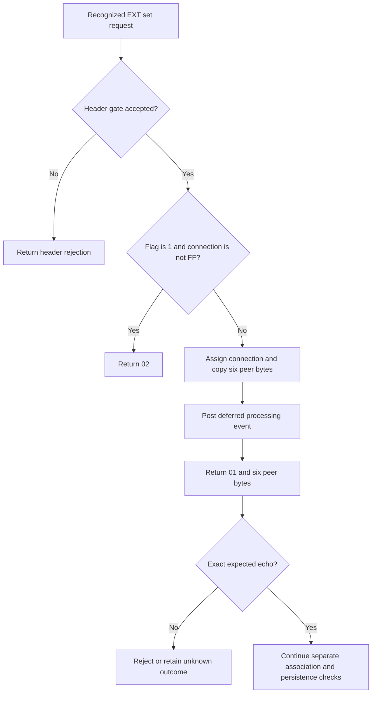
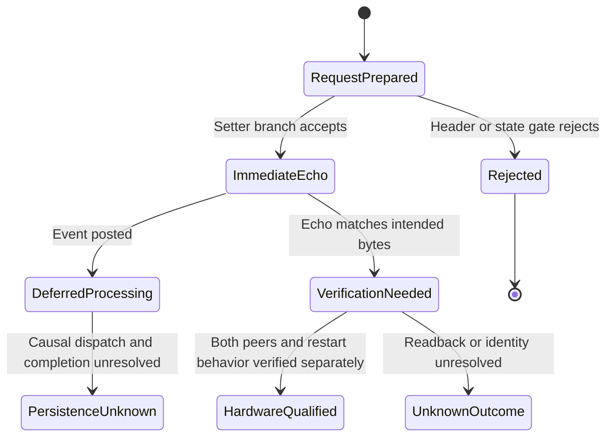

# K10 barrel peer configuration: EXT58 and EXT59

This reference explains what the analyzed firmware does with peer-address commands. It is useful for building a research client and understanding why an acknowledgment alone cannot establish a repaired robot–station pair. It is **not yet a hardware-qualified repair procedure**.

The [machine-readable contract](../contracts/k10-barrel-ext58.json) and [synthetic fixtures](../fixtures/k10-barrel-ext58.json) express the same boundaries. The work tracks [documentation issue 2](https://github.com/d3vi1/switchbot-wocode-docs/issues/2) and [application issue 7](https://github.com/d3vi1/Switchbot-K10-Re-Pair/issues/7).

## Which firmware this describes

| Profile | Original file | SHA-256 | EXT handler | Complete-frame dispatcher |
|---|---|---|---|---|
| Barrel Test 1.02 | `WoSweeperMiniBarrel_app_test_V1002.bin` | `0227cd90a7147c62985bc8a4080157e010b14e8a4ed69f7c2632535ae49479c5` | `0x00810950` | `0x00810CE4` |
| Barrel Prod 1.04 | `WoSweeperMiniBarrel_app_prod_V1004.bin` | `997788eedfa24ddf4b7d7c082b9b8994578296c437c3b11802224f957c5cb219` | `0x00810950` | Unresolved in this pass |

The [corpus inventory](../corpus/firmware-inventory.json) independently identifies these exact file bytes. These profiles do not establish compatibility with every device sold as K10, Pro, K11, K20, or S10.

Below, **F** is a complete frame and **P** begins at its EXT family byte (`58` or `59`). Test 1.02 mode 0 uses P = F + 2. Mode 1 uses P = F + 6, after four additional bytes. The independently examined Prod 1.04 handler establishes **payload-relative coordinates only**; do not assume its complete-frame dispatcher was validated by a matching symbol name.

## Before interpreting a response

For Test 1.02, a frame must begin `57`. A different first byte is not processed as WoCode. Nonzero upper two bits of the next byte return `04`. For EXT mode 0, bit 7 at configuration offset `0x10` must equal bit 5 at offset `0x11`; otherwise the dispatcher returns `07`. These flag meanings remain unassigned. Modes 2 and 3 return `0A`.

Mode 1 has its own comparison gate and rejection `09`. Its precise recovered predicate is retained in the contract without claiming how a client obtains the required token. Therefore, “pairing never requires authentication” is not a supported conclusion.

## Set the six peer bytes

The Test 1.02 mode-0 research encoding is:

| F offset | Length | Meaning |
|---:|---:|---|
| 0 | 1 | `57`: WoCode |
| 1 | 1 | `0F`: mode 0, EXT class |
| 2 | 1 | `58`: family |
| 3 | 1 | `0A`: selector |
| 4 | 1 | `02`: set operation |
| 5 | 1 | Unused by this operation's handler |
| 6 | 6 | Raw protocol peer-address bytes |

Both examined EXT handlers copy P[4..9]. They do not read P[3] in this branch. An encoder can emit `00` at F[5] as an explicit client convention. It is **not a captured vendor value**, and no field meaning is assigned to it.

Emit exactly 12 bytes from the research encoder. The complete Test 1.02 dispatcher and this branch do not enforce that minimum locally; the host contract supplies all six bytes that the firmware reads.

The binding state has a connection identifier, a binding flag, and six peer bytes. Set rejects with one-byte `02` when the flag is 1 **and** the connection identifier is not `FF`. A flag of 1 with connection identifier `FF` does not trigger this rejection.

On acceptance, the handler posts a separate connection event, assigns the current ingress connection identifier, sets the flag to 1, copies the six peer bytes unchanged, and posts event 0 for further processing. The reply is exactly seven bytes: `01` followed by those six bytes in the same order.

An exact matching reply supports “peer bytes echoed.” It does not support “pair repaired,” “both devices agree,” or “saved through a restart.” A timeout, one-byte `01`, extra bytes, or a mismatched echo cannot be accepted as setter verification.

## Clear the peer state

Test 1.02 mode 0 uses `57 0F 58 0A 01`. The branch changes state only when the flag is nonzero **or** the connection identifier equals `FF`. When that condition holds, it clears the flag and six peer bytes and posts event 3. Either way it returns one-byte `01`.

Thus the clear reply alone cannot distinguish a state-changing clear from an accepted no-change branch. Inspect state after interruption before retrying a clear.

For other `58/0A` operations, including `00` and `03`, no pairing mutation is implemented. The Test 1.02 complete dispatcher still returns one-byte `01`. The production EXT branch also performs no pairing mutation, but its returned first byte inherits caller initialization; that complete caller is unresolved. A generic “status 01 means supported” rule is incorrect.

## Read behavior differs by firmware

Test 1.02 has no `59/0A` getter branch. Its complete dispatcher returns only `01`, with no peer data.

Prod 1.04 has a conditional getter. It reads **P[3]**, which must equal `01`; P[2] is ignored in this selector branch. Data is returned only when the binding flag is not 1 **or** the connection identifier is `FF`.

The data reply has 15 bytes:

| Reply offset | Length | Meaning |
|---:|---:|---|
| 0 | 3 | `01 20 01` |
| 3 | 6 | Stored peer bytes, unchanged |
| 9 | 6 | Local source bytes reversed from offsets 2–7 |

When the predicate is false, the production EXT handler returns one-byte `01` without address data. Do not invent different read operations based on P[2], or treat this profile as a universal peer-read API. Production fixtures deliberately provide EXT payloads rather than claiming a validated complete-frame encoding.

## Address representation

For the setter, request peer bytes, stored peer bytes, and the successful reply preserve the same order. Test 1.02 link-state processing at `0x00811AE4` obtains a GAP connection address, reverses its six bytes, and compares that result with the stored peer bytes.

This establishes a relation to the GAP API output. It does **not** independently establish the conversion from a QR label, a displayed MAC, or every advertisement format. A research client should use an explicit six-byte protocol-address type until that identity chain is verified.

## What was wrong with the old 11-byte encoding

The old encoder placed peer bytes directly after `57 0F 58 0A 02`, starting at F[5]. The demonstrated branch starts copying at F[6], so it skips the first supplied peer byte and reads one byte beyond the transmitted message.

The traced Test 1.02 ingress callback at `0x00811E68` clears 247 staging payload bytes before copying the incoming data. **If that ingress accepts the short message**, the resulting peer is the five final supplied bytes followed by `00`. This is a conditional static result, not a captured BLE exchange or a claim about every ingress path.

Ingress additionally requires a matching configured service identifier, event type `03`, event field 4 equal to `01`, and empty staging. The main loop at `0x00816AAC` dispatches that staged payload. The complete CBA characteristic registration chain and runtime transport admission remain unresolved.

## Persistent storage: demonstrated functions, unfinished causal chain

Test 1.02 has verified static load/save wrappers for an eight-byte record starting at RAM `0x002080C7`, at FTL logical offset `0x30`. The record contains the flag, six peer bytes, and an auxiliary counter. Load/save wrappers are at `0x00812880` and `0x008128AC`; the corresponding ROM entries are `0x0000B906` and `0x0000B918`.

The ROM symbol evidence is identified by SHA-256 `48d9dd74b12193a5a77cfd5c86767aa24fd7afe37c63e38e9e50eac6ff253dab`. This repository describes the factual mapping without copying the SDK or decompiled implementation.

The set/clear handler does **not** directly call the save wrapper. A flash callback table suggests that event 0 reaches save/load and event 3 reaches clear/save. The runtime dispatcher uses a RAM table, and the flash-to-RAM initialization link is still unverified. Queue failures, state-machine completion, and storage return handling are also unresolved. These limits prevent promoting the immediate ACK to proof of a durable configuration change.

The `HardwareQualified` state in the diagram describes a future acceptance condition; neither analyzed profile currently reaches that qualification in the release catalog.

## Work still required

1. Resolve the deferred-event table initialization and completion/error path.
2. Locate Prod 1.04's actual complete-frame dispatcher.
3. Finish characteristic registration and ingress admission tracing.
4. Establish QR/advertisement/GAP representation using identified devices.
5. Verify both peer associations, reconnect behavior, and persistence on authorized hardware.

These boundaries accompany the contract into the Swift application and later Kotlin implementation. Structural fixture success is not hardware validation.
