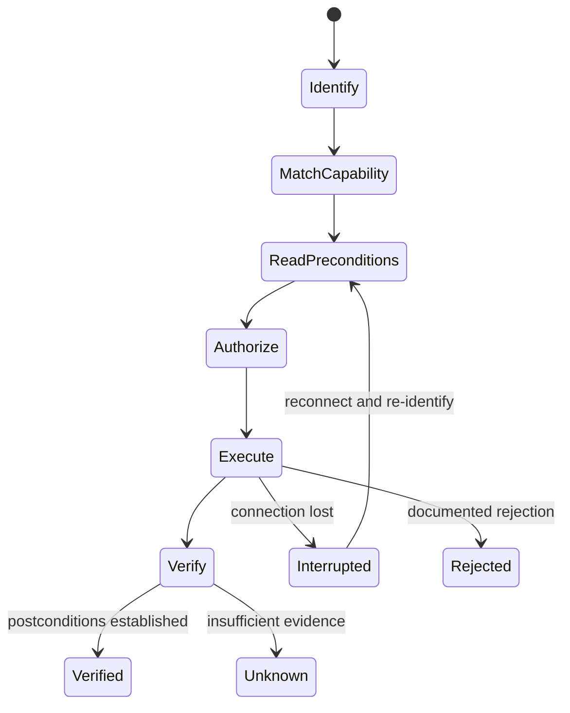
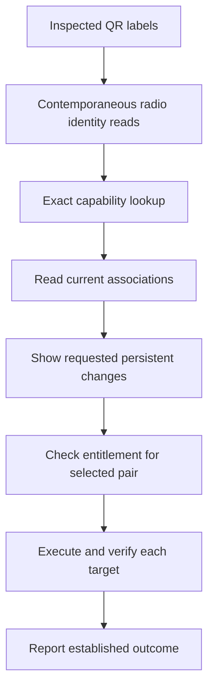

# Shared operation model

Swift and Kotlin implement native transports and share versioned contracts, capability metadata and fixtures. Store APIs do not belong inside a codec.

| Concept | Contract |
| --- | --- |
| `DeviceIdentity` | Canonical MAC, role, model/component identity and the observations that verify it |
| `PairIdentity` | One robot MAC and one station MAC; role order is explicit, never a sorted address bag |
| `OperationContract` | Request/reply layouts, prerequisites, requested effects, postconditions and recovery |
| `CapabilityProfile` | Exact tested hardware and component firmware combination with qualified operations |
| `FirmwareTransition` | Directed source/target application components, image digest and qualified recovery |
| `OperationPlan` | Selected pair, targets, original observations, catalog revision and ordered steps |
| `OperationResult` | Verified, rejected, partially applied, interrupted or unknown outcome plus evidence |
| `PairEntitlement` | Store-specific permanent activation for one robot–station pair |

Effects are `observe`, `runtime`, `persistentConfiguration`, `firmwareTransition` or `unresolved`. A read remains free when firmware incidentally updates a request counter. Unresolved effects are not enabled in the release application.

An executor serializes commands, connects both members before a multi-device mutation and stops on an unrecognized response. After reconnecting, it reads state before retrying writes. A successful set echo is not both-endpoint verification.

The included release catalog is authoritative for support. Purchasing an activation and compiling a community build cannot implicitly qualify untested hardware. The community build can omit payment checks while keeping capability checks active.
